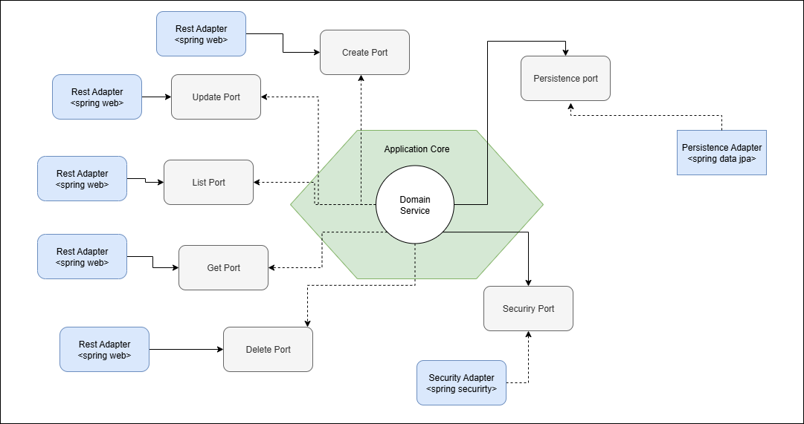
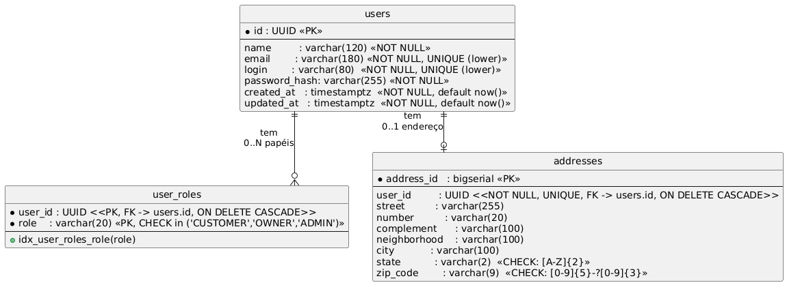

<div align="center">

# Projeto: restaurant-api

(Postech - ADJ - fase 1 - Tech Challenge)

</div>

---

---

## Sumário

- [1. Introdução](#1-introdução)
- [2. Arquitetura do Sistema (Hexagonal)](#2-arquitetura-do-sistema-hexagonal)
- [3. Descrição dos Endpoints da API](#3-descrição-dos-endpoints-da-api)
- [4. Configuração do Projeto](#4-configuração-do-projeto)
- [5. Qualidade do Código](#5-qualidade-do-código)
- [6. Collections para Teste](#6-collections-para-teste)
- [7. Repositório do Código](#7-repositório-do-código)
- [Notas](#notas)

---

## Equipe

| Nome                                             | RM        | E-mail                     |
|--------------------------------------------------|-----------|----------------------------|
| Alexandre Belisário Duarte Leite de Andrade      | RM367163  | alexbdla@gmail.com         |
| Kervin Sama Candido da Silva                     | RM367345  | kervincandido@gmail.com    |

---

## 1. Introdução

### Descrição do problema
Na nossa região, um grupo de restaurantes decidiu contratar estudantes para construir um sistema de gestão para seus 
estabelecimentos. Essa decisão foi motivada pelo alto custo de sistemas individuais, o que levou os restaurantes a se 
unirem para desenvolver um sistema único e compartilhado. Esse sistema permitirá que os clientes escolham restaurantes 
com base na comida oferecida, em vez de se basearem na qualidade do sistema de gestão.

O objetivo é criar um sistema robusto que permita a todos os restaurantes gerenciar eficientemente suas operações, 
enquanto os clientes poderão consultar informações, deixar avaliações e fazer pedidos online. Devido à limitação de 
recursos financeiros, foi acordado que a entrega do sistema será realizada em fases, garantindo que cada etapa seja 
desenvolvida de forma cuidadosa e eficaz.

A divisão em fases possibilitará uma implementação gradual e controlada, permitindo ajustes e melhorias contínuas 
conforme o sistema for sendo utilizado e avaliado tanto pelos restaurantes quanto pelos clientes.

### Objetivo do projeto
Desenvolver um backend robusto utilizando Spring Boot para gerenciar usuários e atender aos requisitos definidos.

---

## 2. Arquitetura do Sistema (Hexagonal)

### Visão geral da arquitetura

Para o desenvolvimento do projeto, optamos pela **Arquitetura Hexagonal**, um padrão apresentado durante uma das aulas.

A Arquitetura Hexagonal, também denominada **Arquitetura de Portas e Adaptadores**, foi proposta originalmente pelo 
Dr. Alistair Cockburn em 2005. Trata-se de um padrão de design de software que se baseia em um princípio fundamental: 
**o isolamento estrito da lógica de domínio (ou lógica de negócios) de quaisquer dependências externas à aplicação**.

Os principais objetivos dessa arquitetura são:

- Criar um **núcleo de aplicação** (o “hexágono”) independente de tecnologias específicas.
- Fazer com que a lógica de negócio opere sem conhecimento direto de como as implementações externas funcionam, 
focando-se apenas nas regras de negócio.
- Separar o núcleo da aplicação das implementações externas por meio de:
    - **Portas (ports):** interfaces que definem contratos de comunicação.
    - **Adaptadores (adapters):** implementações específicas para tecnologias externas.

Essa abordagem permite:

- Maior flexibilidade;
- Alta testabilidade do código;
- Facilidade de manutenção e evolução.

### Organização dos pacotes

No projeto, o código foi separado nos pacotes `application` e `infrastructure`:

- **`application`**: núcleo da aplicação (regras de negócio).
- **`infrastructure`**: camada de infraestrutura, contendo as implementações técnicas (banco de dados, segurança, REST, 
etc.).

Dentro de `application`, subdividimos em:

- **`domain`**
- **`service`**
- **`ports`**

#### Pacote `domain`

É onde ficam as **classes de domínio**, como:

- Representação do usuário;
- Endereço do usuário;
- Papéis (roles) do usuário no sistema;
- Classes de **exceção de negócio** da aplicação.

#### Pacote `service`

É onde ficam os **casos de uso**.

- A principal classe é o `UserService`, que provê as principais ações para o usuário **sem detalhes de implementação**.
- Nesse pacote, utilizamos apenas:
    - Classes do `domain`;
    - Interfaces que definem o que a infraestrutura deve fazer, sem se importar com o *como*.

#### Pacote `ports`

Define os pontos de **entrada** e **saída** (inbound e outbound, respectivamente) entre `application` e `infrastructure`.

- **Pacote `inbound` (entrada):**
  Contém as classes que, expostas para a infraestrutura, permitem que esta se comunique com o núcleo da aplicação e as 
interfaces que definem métodos como a infraestrutura envia os dados para o núcleo da aplicação.

- **Pacote `outbound` (saída):**
  Contém as interfaces que definem os **comportamentos esperados da infraestrutura**, por exemplo:
    - Interface para persistência de dados;
    - Interface para criptografia de senha.

### Camada de infraestrutura

Dentro do pacote `infrastructure`, há o pacote `adapters`, que contém as classes que **implementam** as interfaces 
definidas em `ports`.

Dentro de `adapters`, dividimos em:

#### `adapters.inbound` (entrada)

Contém as implementações de entrada de dados via **API REST**.

- A implementação foi feita com **Spring**.
- As classes estão localizadas no pacote `rest`, que contém os **controllers**.
- Dentro de `rest`, criamos os pacotes:
    - `form`: classes usadas para mapear os campos das **requisições** para a API;
    - `dto`: classes usadas para mapear as **respostas** da API.

#### `adapters.outbound` (saída)

Contém as implementações para:

- **Persistência** no banco de dados, usando **Spring Data JPA**;
- **Criptografia de senha**, utilizando **Spring Security**.

### Infraestrutura do sistema

Na infraestrutura do sistema, utilizamos o **Docker** para o gerenciamento de containers, com o **Docker Compose** para 
orquestrar a execução da aplicação.

As imagens utilizadas são:

- `postgres:16`: para o banco de dados;
- Imagem própria baseada em `nginx:alpine`: para servir uma página com detalhes dos erros que a API retorna, seguindo o 
padrão **Problem Details (RFC 7807)**;
- Imagem própria da aplicação:
    - `maven:3.9-eclipse-temurin-21` para o **build** (construção) da aplicação;
    - `eclipse-temurin:21-jre` como imagem base para a **execução** da aplicação.

No arquivo de configuração do Docker Compose, adotamos alguns cuidados essenciais:

- **Configuração de Volume:** para garantir a persistência dos dados e evitar perdas quando o stack do Docker Compose 
for derrubado;
- **`depends_on`:** diretiva na imagem da aplicação para que ela só inicie após a subida do banco de dados;
- **`healthcheck`:** configuração para garantir que serviços que dependem do banco (via `depends_on`) só iniciem quando 
o banco estiver pronto e acessível.

### Banco de dados

O banco de dados escolhido foi o **PostgreSQL**, devido à maior familiaridade dos membros do grupo com essa tecnologia.

### Diagrama da Arquitetura

<p align="center">
  
</p>

#### Descrição

A aplicação foi estruturada seguindo o padrão de arquitetura hexagonal. No nosso caso:

- **Core de domínio** (círculo branco): pacotes `domain` e `service`, onde está concentrada a lógica de negócio.
- **Ports** (retângulos cinza): interfaces que medeiam a comunicação entre o core da aplicação e a infraestrutura, tanto 
para entrada quanto para saída.
- **Adapters** (retângulos azuis): implementações concretas na borda do sistema (REST, persistência, etc.) que se 
conectam aos ports.

O fluxo mais comum da aplicação é:

1. A requisição chega por um **adapter de entrada** (por exemplo, endpoints REST de `create`, `get` e `list`).
2. O adapter converte a requisição e chama a **lógica de negócio** no core por meio de um **port de entrada**.
3. A lógica de negócio, quando precisa acessar recursos externos, utiliza **ports de saída** para acionar **adapters de 
persistência**, que podem salvar, alterar, excluir ou consultar dados.
4. O resultado retornado pelos adapters de saída é processado pela lógica de negócio e enviado de volta ao **adapter de 
entrada**, que monta a resposta HTTP para o cliente.


### Diagrama das Entidades e Relacionamentos

<p align="center">
  
</p>

#### Descrição
 
O diagrama representa o modelo de dados responsável por armazenar usuários, seus papéis (roles) no sistema e o endereço 
associado.

- **Tabela `users`**
    - **Chave primária**: `id : UUID`.
    - Armazena os dados principais do usuário:
        - `name`: nome completo.
        - `email`: obrigatório, único (em formato case-insensitive via `UNIQUE (lower)`).
        - `login`: obrigatório, único (também case-insensitive).
        - `password_hash`: hash da senha, nunca armazenando a senha em texto puro.
        - `created_at` e `updated_at`: timestamps com fuso horário, preenchidos por padrão com `now()`.
    - É a entidade central do modelo, da qual derivam os papéis e o endereço.

- **Tabela `user_roles`**
    - **Chave primária composta**: (`user_id`, `role`).
    - **`user_id`**: referência para `users.id`, com **`ON DELETE CASCADE`** (ao remover um usuário, todos os seus papéis são removidos automaticamente).
    - **`role`**: papel do usuário no sistema, com restrição:
        - `CHECK in ('CUSTOMER','OWNER','ADMIN')`
    - Índice auxiliar `idx_user_roles_role(role)` para facilitar consultas por papel (por exemplo, listar todos os ADMIN).

- **Tabela `addresses`**
    - **Chave primária**: `address_id : bigserial`.
    - **`user_id`**: referência para `users.id`, com **`ON DELETE CASCADE`** e **`UNIQUE`**, garantindo:
        - Cada usuário pode ter **no máximo um endereço**.
        - Um endereço pertence sempre a um único usuário.
    - Campos de endereço:
        - `street`, `number`, `complement`, `neighborhood`, `city`.
        - `state`: UF com validação `CHECK: [A-Z]{2}` (ex.: RJ, SP, MG).
        - `zip_code`: CEP com validação `CHECK: [0-9]{5}-?[0-9]{3}` (aceita `12345678` ou `12345-678`).

- **Relacionamentos**
    - `users ||--o{ user_roles` — Um usuário **pode ter zero ou muitos papéis**:
        - Ex.: um usuário pode ser apenas `CUSTOMER`, ou `OWNER` e `ADMIN` ao mesmo tempo.
    - `users ||--o| addresses` — Um usuário **pode ter zero ou um endereço**:
        - Ex.: logo após o cadastro o usuário pode não ter endereço, que pode ser incluído ou atualizado depois.

#### Fluxo típico de uso

1. Um novo usuário é criado na tabela `users` com `name`, `email`, `login` e `password_hash`.
2. Em seguida, são atribuídos um ou mais papéis na tabela `user_roles` (por exemplo, `CUSTOMER` por padrão).
3. Opcionalmente, é cadastrado um endereço em `addresses` vinculado a esse usuário.
4. Quando o usuário é removido de `users`, seus registros em `user_roles` e `addresses` são automaticamente removidos 
via `ON DELETE CASCADE`, mantendo a integridade referencial do banco.

---

## 3. Descrição dos Endpoints da API

### Tabela de Endpoints

| Path                              | Métodos          | Segurança      | Sumário por método                                                                                                                                  | Códigos de resposta                                                                                                                                 |
|-----------------------------------|------------------|----------------|-----------------------------------------------------------------------------------------------------------------------------------------------------|-----------------------------------------------------------------------------------------------------------------------------------------------------|
| **/api/v1/users**                 | GET, PUT, POST   | **Bearer JWT** | **GET**: Busca usuários pelo nome (paginado). **PUT**: Atualiza dados do usuário logado (exceto senha). **POST**: Cria usuário ADMIN/OWNER (admin). | **GET**: 200, 400, 401, 403, 409, 422, 500<br>**PUT**: 200, 400, 401, 403, 404, 409, 422, 500<br>**POST**: 201, 400, 401, 403, 409, 422, 500        |
| **/api/v1/users/{uuid}**          | GET, PUT, DELETE | **Bearer JWT** | **GET**: Busca usuário por UUID. **PUT**: Atualiza outro usuário (ADMIN/OWNER). **DELETE**: Exclui usuário por UUID.                                | **GET**: 200, 400, 401, 403, 404, 409, 422, 500<br>**PUT**: 200, 400, 401, 403, 404, 409, 422, 500<br>**DELETE**: 204, 400, 401, 403, 409, 422, 500 |
| **/api/v1/users/change-password** | PUT              | **Bearer JWT** | **PUT**: Altera senha do usuário autenticado.                                                                                                       | **PUT**: 204, 400, 401, 403, 404, 409, 422, 500                                                                                                     |
| **/api/v1/users/customer**        | POST             | **Público**    | **POST**: Cria usuário com papel de cliente (registro público).                                                                                     | **POST**: 201, 400, 401, 403, 409, 422, 500                                                                                                         |
| **/api/v1/auth**                  | POST             | **Público**    | **POST**: Autentica um usuário (login).                                                                                                             | **POST**: 200, 400, 401, 403, 409, 422, 500                                                                                                         |


### Documentação & Saúde


| Método | Path/URL                       | Descrição                                 | Observações                                                         |
|:------:|--------------------------------|-------------------------------------------|---------------------------------------------------------------------|
|  GET   | `/v3/api-docs`                 | Documento OpenAPI 3.0 (JSON)              | Habilitado pelo **springdoc**. Útil para gerar docs/clients.        |
|  GET   | `/swagger-ui/index.html`       | UI do Swagger                             | Navegação interativa da API.                                        |
|  GET   | `/actuator/health`             | Healthcheck da aplicação                  | **Spring Boot Actuator**. Em produção, exponha apenas o necessário. |
|  GET   | `/api/v1/_ping`                | **Ping (liveness) da API**                | **Público**. Retorna 200 com `{"status":"ok"}`.                     |
|  GET   | `http://localhost:8081/erros/` | Catálogo de Problem Types (RFC 7807/9457) | Servido pelo container **problem-docs**.                            |


### Exemplos de requisição e resposta (coleção Postman)

> **Variáveis usadas nos exemplos**
> `BASE_URL=http://localhost:8080`
> Header comum (quando indicado): `Content-Type: application/json`

---

#### Auth

##### 1) Login (ADMIN) — 200 OK

**POST** `/api/v1/auth`

**cURL**

```bash
curl -X POST "$BASE_URL/api/v1/auth" \
  -H "Content-Type: application/json" \
  -d '{
    "login": "admin",
    "password": "SenhaDev#123"
  }'
```

**Response — 200 OK**

```json
{
  "accessToken": "eyJhbGciOiJIUzUxMiJ9.eyJpc3MiOiJSZXN0YXVyYW50LUFQSSIsInN1YiI6Ijg3NGU0NTY3LTgyYjktNGU3ZC1iNzFiLTJmOTYzODY0NTFiMyIsInBzZHYiOiJ... (truncado)",
  "tokenType": "Bearer",
  "expiresIn": 3600
}
```

---

##### 2) Login (CUSTOMER com senha nova) — 401 Unauthorized

**POST** `/api/v1/auth`

**cURL**

```bash
curl -X POST "$BASE_URL/api/v1/auth" \
  -H "Content-Type: application/json" \
  -d '{
    "login": "<seu_login>",
    "password": "<senha_nova>"
  }'
```

**Response — 401 Unauthorized (Problem Details)**

```json
{
  "type": "http://localhost:8081/erros/unauthorized",
  "title": "Falha ao autenticar",
  "status": 401,
  "detail": "Falha ao autenticar o usuário, verifique as credenciais e tente novamente.",
  "instance": "/api/v1/auth",
  "timestamp": "2025-11-03T21:56:49.96688057-03:00",
  "reason": "Bad credentials"
}
```

---

#### Users

##### 3) Criar Customer (registro público) — 201 Created

**POST** `/api/v1/users/customer`

**cURL**

```bash
curl -X POST "$BASE_URL/api/v1/users/customer" \
  -H "Content-Type: application/json" \
  -d '{
    "name": "Test User 2025-11-04",
    "email": "helen.weissnat750@gmail.com",
    "login": "user_2ba2780d",
    "password": "SenhaDev#123",
    "address": {
      "street": "Rua das Flores",
      "number": "100",
      "city": "São Paulo",
      "neighborhood": "Pinheiros",
      "state": "SP",
      "zipCode": "12345-678"
    }
  }'
```

**Response — 201 Created**

```json
{
  "id": "d2b37cae-21c5-48dd-9fa7-9168d2122a7b",
  "name": "Test User 2025-11-04T00:55:35.145Z",
  "email": "helen.weissnat750@gmail.com",
  "login": "user_2ba2780d",
  "roles": ["CUSTOMER"],
  "createdAt": "2025-11-04T00:55:35.547515800Z",
  "updatedAt": "2025-11-04T00:55:35.590467800Z",
  "address": {
    "street": "Rua das Flores",
    "number": "100"
  }
}
```

---

##### 4) Alterar senha (self — CUSTOMER) — 204 No Content

> Requer `Authorization: Bearer <TOKEN_CUSTOMER>`

**PUT** `/api/v1/users/change-password`

**cURL**

```bash
curl -X PUT "$BASE_URL/api/v1/users/change-password" \
  -H "Authorization: Bearer <TOKEN_CUSTOMER>" \
  -H "Content-Type: application/json" \
  -d '{
    "currentPassword": "SenhaDev#123",
    "newPassword": "NovaSenha#123",
    "confirmNewPassword": "NovaSenha#123"
  }'
```

**Response — 204 No Content**

```
[sem corpo]
```

---

##### 5) Consultar usuário por UUID (usando token antigo após trocar a senha) — 401 Token Revoked

> Cenário do Postman: depois do passo 4, tente usar o **token antigo**.

**GET** `/api/v1/users/{uuid}`

**cURL**

```bash
curl -X GET "$BASE_URL/api/v1/users/d2b37cae-21c5-48dd-9fa7-9168d2122a7b" \
  -H "Authorization: Bearer <TOKEN_ANTIGO>"
```

**Response — 401 Unauthorized (Token revogado)**

```json
{
  "type": "http://localhost:8081/erros/token-revoked",
  "title": "Token revoked",
  "status": 401,
  "detail": "Seu token foi revogado. Autentique-se novamente.",
  "instance": "/api/v1/users/d2b37cae-21c5-48dd-9fa7-9168d2122a7b",
  "properties": {
    "timestamp": "2025-11-03T21:56:18.728039800-03:00"
  }
}
```

---

##### 6) Consultar usuário por UUID **sem autenticação** — 401 Unauthorized

**GET** `/api/v1/users/{uuid}`

**cURL**

```bash
curl -X GET "$BASE_URL/api/v1/users/00000000-0000-0000-0000-000000000000"
```

**Response — 401 Unauthorized**

```json
{
  "type": "http://localhost:8081/erros/unauthorized",
  "title": "Unauthorized",
  "status": 401,
  "detail": "Full authentication is required to access this resource",
  "instance": "/api/v1/users/00000000-0000-0000-0000-000000000000",
  "properties": {
    "timestamp": "2025-11-04T18:38:46.248063-03:00"
  }
}
```

---

##### 7) Atualizar (self) **sem autenticação** — 401 Unauthorized

**PUT** `/api/v1/users`

**cURL**

```bash
curl -X PUT "$BASE_URL/api/v1/users" \
  -H "Content-Type: application/json" \
  -d '{
    "name": "Novo Nome",
    "email": "novo.email@mail.com",
    "login": "novologin"
  }'
```

**Response — 401 Unauthorized**

```json
{
  "type": "http://localhost:8081/erros/unauthorized",
  "title": "Unauthorized",
  "status": 401,
  "detail": "Full authentication is required to access this resource",
  "instance": "/api/v1/users",
  "properties": {
    "timestamp": "2025-11-03T21:57:11.537680700-03:00"
  }
}
```

---

#### Admin (sem autenticação — exemplos negativos salvos)

##### 8) GET user by UUID (ADMIN) — 401 Unauthorized

**GET** `/api/v1/users/{uuid}`

**cURL**

```bash
curl -X GET "$BASE_URL/api/v1/users/d2b37cae-21c5-48dd-9fa7-9168d2122a7b"
```

**Response — 401 Unauthorized**

```json
{
  "type": "http://localhost:8081/erros/unauthorized",
  "title": "Unauthorized",
  "status": 401,
  "detail": "Full authentication is required to access this resource",
  "instance": "/api/v1/users/d2b37cae-21c5-48dd-9fa7-9168d2122a7b",
  "properties": {
    "timestamp": "2025-11-03T21:57:52.099983100-03:00"
  }
}
```

---

##### 9) DELETE user (ADMIN) — 401 Unauthorized

**DELETE** `/api/v1/users/{uuid}`

**cURL**

```bash
curl -X DELETE "$BASE_URL/api/v1/users/d2b37cae-21c5-48dd-9fa7-9168d2122a7b"
```

**Response — 401 Unauthorized**

```json
{
  "type": "http://localhost:8081/erros/unauthorized",
  "title": "Unauthorized",
  "status": 401,
  "detail": "Full authentication is required to access this resource",
  "instance": "/api/v1/users/d2b37cae-21c5-48dd-9fa7-9168d2122a7b",
  "properties": {
    "timestamp": "2025-11-03T21:58:16.211118-03:00"
  }
}
```
---

## 4. Configuração do Projeto

### 4.1 Arquivos (infra/)

* `.env`
* `docker-compose.yml` → orquestra **postgres**, **problem-docs** (8081) e **app** (8080).
* `Dockerfile` → build multi-stage (Maven + JRE 21).

### 4.2 Perfis

* **stack**: tudo no Docker (postgres + problem-docs + app).
* **ide**: só postgres no Docker; app roda na IDE/JAR.

### 4.3 Como o compose orquestra

* `postgres` (perfil `ide`,`stack`): volume `db_data`, healthcheck `pg_isready`.
* `problem-docs` (perfil `stack`): site estático dos Problem Types na **8081**.
* `app` (perfil `stack`): depende de `postgres` e `problem-docs`; healthcheck em `/actuator/health`.

  > Dentro do Docker use `SPRING_DATASOURCE_URL=jdbc:postgresql://postgres:5432/app`. Fora do Docker, use `…://localhost:5432/app`.

### 4.4 Como executar local
Um link com arquivo .env de exemplo é disponibilido no final desse documento.
```bash
cd infra
docker compose --env-file .env --profile stack up -d --build
# check
curl http://localhost:8080/actuator/health
```

### 4.5 URLs

* API: `http://localhost:8080`
* Health: `http://localhost:8080/actuator/health`
* Swagger: `http://localhost:8080/swagger-ui/index.html`
* Problem Docs (stack): `http://localhost:8081/`

---


## 5. Qualidade do Código

### Boas Práticas Utilizadas

**Arquitetura e SOLID**

* **Arquitetura Hexagonal (Ports & Adapters)**: separação explícita entre domínio (`application.domain.*`), portas de entrada/saída (`application.ports.*`) e adaptadores de infraestrutura (`infrastructure.adapters.*`). Isso reduz acoplamento e facilita testes e evolução.
* **D**IP (Dependency Inversion): casos de uso conversam com o mundo externo via **ports** (`UserPersistence`, `PasswordEncoder`, etc.), e os **adapters** concretos injetam implementações (JPA, BCrypt).
* **S**RP (Single Responsibility): classes pequenas e focadas (ex.: `TokenExtractorService`, `ProblemDetails*Handler`, `UserPersistenceAdapter`, `PasswordEncoderImpl`).
* **I**SP (Interface Segregation): interfaces específicas por intenção (ex.: `ForCreatingUser`, `ForUpdatingUser`, `ForChangingUserPassword`, `ForListingUserOutput`), evitando contratos “inchados”.
* **O**CP (Open/Closed): validações de negócio compostas por **regras plugáveis** (`Rule<T>`, `CreateUserValidator`, `UpdateUserValidator`). Incluir novas regras não exige mudar o core do caso de uso.

**Domínio Rico e Modelagem**

* **Value Objects imutáveis** (Java `record`) com **invariantes no construtor**: `Email` (normaliza/lower-case), `Password` (força forte) e `Role` (normaliza UPPERCASE). Violação de invariantes lança `DomainException`.
* **Entidades de domínio** (`User`, `Address`) separadas de DTOs/Forms da camada web. Mapeamentos claros nos *Mappers*.
* **Paginação** tipada (`Page`, `Pagination<T>`) e **DTO de paginação** consistente para a API.

**DRY e Convenções**

* **Tratamento de erros centralizado** com **Problem Details (RFC 7807/9457)** em `GlobalExceptionHandler` e handlers de Security — evita duplicação e padroniza payloads (ex.: `type`, `title`, `detail`, `instance`, `invalidParams`).
* **Normalização de login/e-mail** em múltiplas camadas (domínio e JPA `@PrePersist/@PreUpdate`) para manter consistência.
* **Configuração externa** por perfis (`dev`, `test`, `prod`) e variáveis de ambiente, respeitando o **12-factor**.
* **Convenções Spring Boot**:

    * Controllers enxutos (DTO/Form ↔ caso de uso).
    * Beans criados por **config classes** ou `@ConfigurationProperties`.
    * **Actuator** para health/env e healthcheck de containers.

**Validação e Regras de Negócio**

* **Bean Validation** (anotações nas *forms*) para validar payloads HTTP.
* **Validação no domínio** (VOs) e **validação de negócio** (regras de unicidade `email/login` via ports) → erros agregados em `BusinessValidationException` com retorno **422**.
* **Respostas consistentes**: `400` (payload/parâmetros), `401/403` (auth/authz), `409` (violação de unicidade), `422` (regras de negócio), `500` (exceções não mapeadas).

**Segurança**

* **JWT stateless** com assinatura HMAC (JJWT), **expiração configurável** e *claim* `pwdv` (password version) para **revogação de token na troca de senha**.
* **BCrypt** com *work factor* configurado para hashing seguro.
* **Força de senha** exigida no VO `Password` (mínimo de caracteres, dígitos, maiúsculas, minúsculas e caractere especial).
* **Fluxo de “password change required”** (flag na entidade, `ForcePasswordPolicyFilter` e Problem Details específico).
* **Minimiza enumeração de usuários** no *login* (mensagens genéricas em `JpaUserDetailsService`).
* **Autorização por escopo de rota** e `@PreAuthorize` (ex.: autoatualização vs. atualização por ADMIN/OWNER).
* **CORS** configurável por ambiente.

**Persistência e Banco de Dados**

* **Flyway** versionado (V1…Vn), **seeds** para DEV e migração de papéis (`CLIENT` → `CUSTOMER`) com *constraint* atualizada.
* **Índices e unicidade**: `LOWER(email/login)` para **case-insensitive unique** (garante no banco), e tratamento de `DataIntegrityViolationException` → **409**.
* **1–1 Address/User** com `UNIQUE(user_id)` e *checks* de sanidade (UF e CEP).
* **Timestamps** com `created_at/updated_at` e *trigger* de atualização no BD — mais `@PrePersist/@PreUpdate` para robustez.
* **H2 (modo PostgreSQL)** isolado para **test profile**, com `ddl-auto=create-drop` e **Flyway desabilitado** (evita conflito).

**Documentação e Contrato de API**

* **OpenAPI/Swagger** com `@OpenAPIDefinition` e `@SecurityScheme` (Bearer), exemplos nos DTOs, versionamento de rota (`/api/v1`) e **endpoints separados** para senha, login e cadastro público de CUSTOMER.
* **Problem Docs** servidos em container dedicado (`problem-docs`) e referenciados pelo `type` dos problemas (melhora DX).

**Contêineres e Operação**

* **Docker multi-stage** (build com Maven + runtime JRE), imagem final enxuta e **healthcheck via Actuator**.
* **Compose por perfis**.

* **Propriedades sensíveis** vindas do ambiente (`.env/.env.prod`) — sem hardcode no código.


---

## 6. Collections para Teste

As collections e o environment estão versionados no repositório, em:
`/postman` (na raiz do projeto `restaurant-api`).

Basta importar no Postman os arquivos desta pasta (`*.postman_collection.json` e `*.postman_environment.json`):

1.  Abra o Postman → **Import** → **Files** → selecione os arquivos em `/postman`. (ou simplesmente arraste e solte os arquivos na janela do Postman).
2.  Clique na pasta principal da collection importada, ela deve está com o nome “REST API Restaurantes - Tech Challenge Fase 1”, ao clica o postman abrirá uma aba
3. Clique no botão “Run” localizado no canto superior esquerdo, o postman abrirá uma nova aba para selecionar os quais requisições ele deve executar. Por padrão ele seleciona tudo.
4. Clique no botão “Run REST API Restaurantes - Te…” é o botão de cor laranja do lado direito. 
> Com isso o postman executará todos os cenários de testes que mapeamos, tanto positivo, como os negativos (que deve validar e retornar erro)
Os cenários mapeados ficaram dentro da pasta “Casos de Teste”, dentro dela é possível navegar e testar os cenários desejados.
Ao passar o mouse na pasta de cada cenário aparecerá no canto esquerdo da pasta três pontos, clicando nesses três pontos aparecerá mais opções entre elas a opção “Run” para por executar a pasta especifica.

5. Verificar resultados: ao executar o postman mostrará como está andando a execução dos testes, mostrando quantos testes passaram e quantos falharam. 
> A validação dos testes é principalmente pelo status code retornado da requisição que se encontra no canto esquerdo do cenário listado pelo postman.
> Para testes de cenários específicos: como alguns casos de testes necessitam de passos anteriores para serem testados como se autenticar por exemplo é recomendado executar a pasta do cenário especifico inteiro ou se desejar executar manualmente, executar na ordem que está na pasta.

---

## 7. Repositório do Código

### URL do Repositório

[GitHub](https://github.com/alex-dev-br/restaurant-api)

---

## Notas

> Pode haver algum ajuste ou informação adicional relevante no `README` do projeto, favor conferir a última versão lá.

> Esta documentação é viva. Em caso de divergência, a especificação OpenAPI em /v3/api-docs é a fonte da verdade para endpoints e contratos.


> Baixar as variáveis .env em: [Variáveis de ambiente (`.env*`)](https://drive.google.com/drive/folders/1zecaD_clnVvDgNbhSVjSDCiQUqxAiLMZ?usp=drive_link) e colocar em `\infra`
